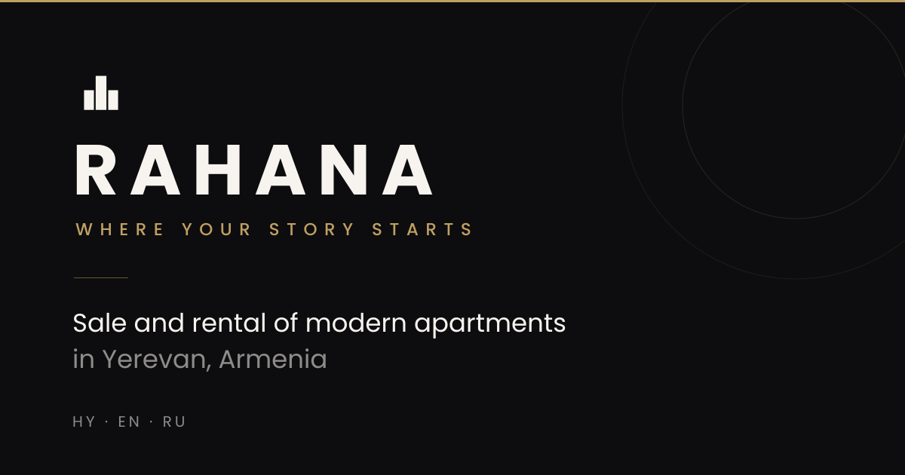
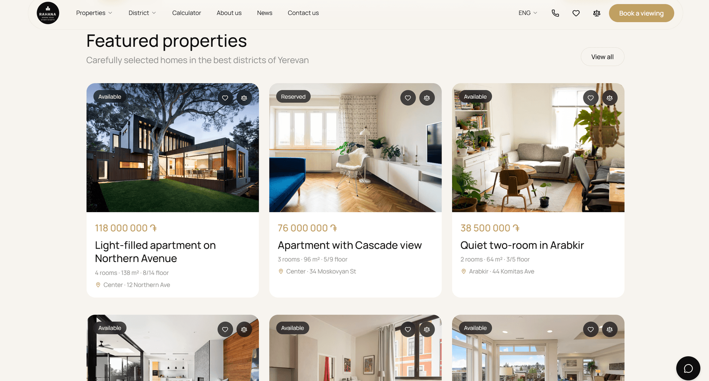
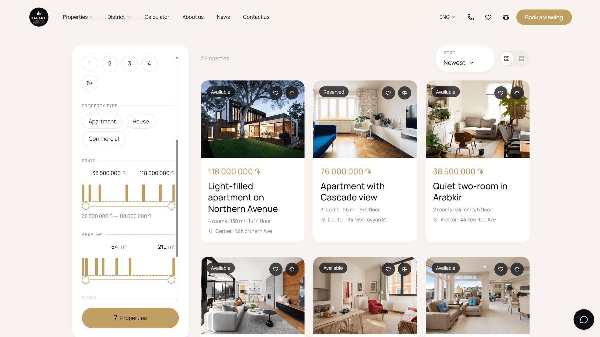
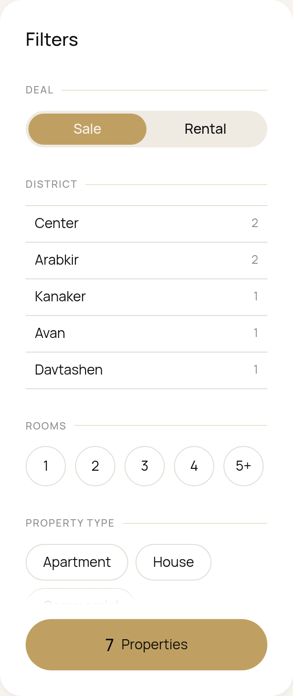
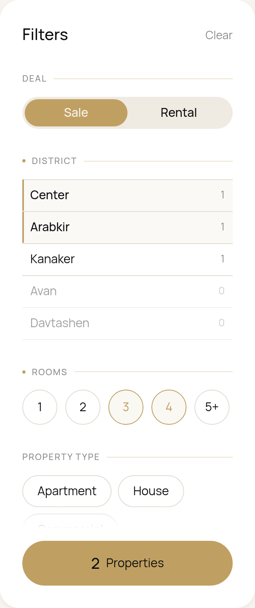
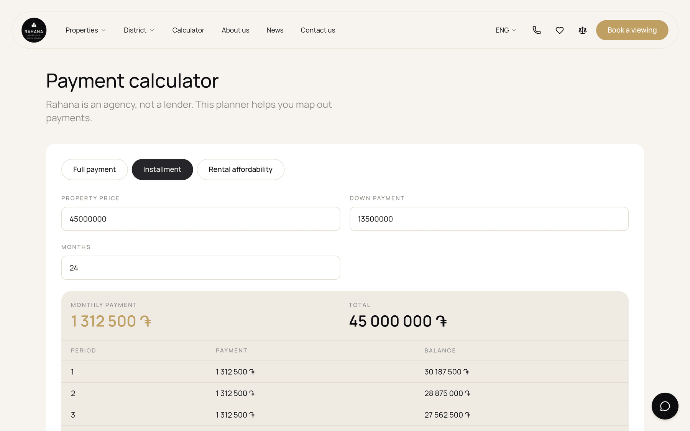
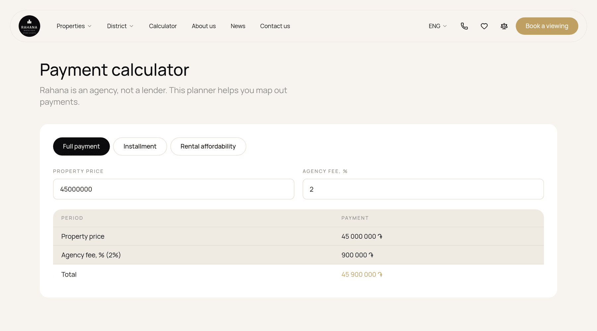
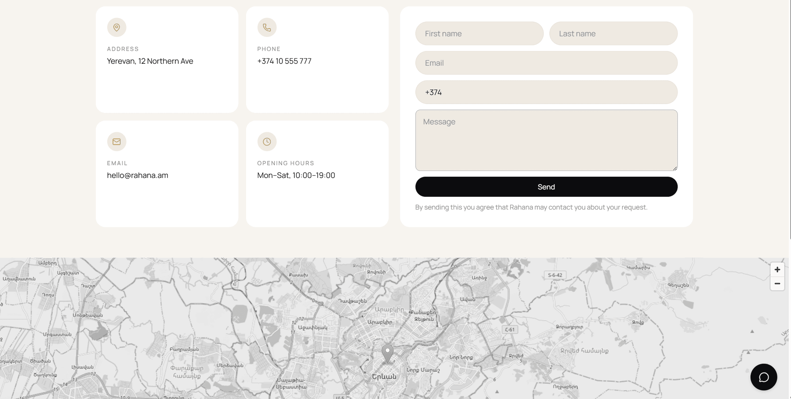
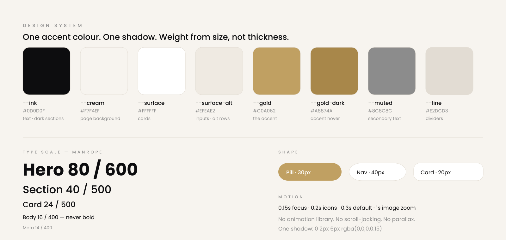

<div align="center">



<h1>Rahana Estates</h1>

<p><strong>A photography-led real-estate website for a Yerevan estate agency.</strong><br>
Server-rendered, trilingual, URL-driven search — built on TanStack Start, React 19 and Tailwind CSS v4.</p>

<p>
  <a href="LICENSE"></a>
  
  
  
  
  
  <a href="../../actions/workflows/ci.yml"></a>
</p>

<p>
  <a href="https://rahana.online"></a>
</p>

</div>



---

## Why this repo

Most real-estate templates are a grid of cards and a contact form. This one is a complete, opinionated
product: a **filter engine whose entire state lives in the URL**, a **payment planner** with three
calculation modes, side-by-side **property comparison**, and a **three-language interface** (Armenian,
English, Russian) that stays correct through server rendering.

And it is deliberately restrained. One accent colour. One shadow. No animation library. The photography
carries the emotion and the interface gets out of the way — a discipline documented below so you can keep
it while you make the project yours.

---

## The catalogue

Filters on the left, results on the right, and **everything in the URL**. Change a district and the address
bar changes with it, so any result set is a link you can send to a client. Cards carry the price in dram,
the room / area / floor line, the district, and one-tap shortlist and compare buttons. Grid or list, your
choice — that's in the URL too.



---

## The filter engine

Districts show **live counts that respect every other active filter**, options that would return nothing
are disabled rather than hidden, and the price and area sliders draw the **real distribution of the current
result set** above the track — so you can see where the market actually sits before you drag anything.

<table>
<tr>
<td width="50%" valign="top"></td>
<td width="50%" valign="top"></td>
</tr>
<tr>
<td align="center"><em>Default — every district available</em></td>
<td align="center"><em>Filtered — dot markers, price histogram, counts recalculated</em></td>
</tr>
</table>

---

## The payment planner

Three modes, no lender maths hidden in a black box. **Full payment** adds the agency fee. **Installment**
builds a month-by-month amortisation table from the price, down payment and term. **Rental affordability**
turns income, rent and utilities into a load ratio with a plain-language verdict.



<details>
<summary><strong>Full payment mode</strong></summary>

<br>



</details>

---

## Enquiries

Contact details as cards, a validated enquiry form, and a desaturated OpenStreetMap embed that keeps the
monochrome discipline. The same form powers the "Book a viewing" modal available from every page and every
property.



---

## Features

|                               |                                                                                                                                                                                      |
| ----------------------------- | ------------------------------------------------------------------------------------------------------------------------------------------------------------------------------------ |
| **URL-native search**         | Deal, district, rooms, type, price, area, floor, status, sort and view are all validated search params. Links are shareable, the back button works, SSR renders the filtered result. |
| **Live-counting filters**     | Each district shows how many properties match _given every other active filter_. Dead options are disabled, not hidden.                                                              |
| **Histogram ranges**          | Price and area sliders draw the real distribution of the current result set.                                                                                                         |
| **Payment planner**           | Full payment with agency fee, installment schedule with amortisation table, rental affordability ratio.                                                                              |
| **Favourites & compare**      | Shortlist any property, or put up to four side by side in a spec-by-spec table. Persisted in `localStorage`.                                                                         |
| **Trilingual (hy / en / ru)** | A typed dictionary with compile-time key checking. Every content object carries all three locales.                                                                                   |
| **SEO out of the box**        | Per-route titles, descriptions, canonical URLs, Open Graph and Twitter cards, `RealEstateAgent` JSON-LD.                                                                             |
| **Server rendering**          | TanStack Start SSR with a hardened error boundary — h3's swallowed 500s are unwrapped so real stack traces reach your logs.                                                          |
| **Accessible by default**     | Real buttons, `aria-pressed` / `aria-expanded` state, keyboard-navigable dropdowns with type-ahead, visible gold focus rings.                                                        |

---

## Design system

Defined once in `src/styles.css` as Tailwind v4 `@theme` tokens — seven colours, one shadow, four radii.



Three rules keep it coherent:

1. **Gold is the only colour.** Everything else is ink, cream and one grey. No second accent, no decorative gradients.
2. **Weight comes from size, not thickness.** Body is always 400; headings never pass 600.
3. **One shadow,** used rarely. Cards separate by whitespace and background tint.

The signature element is the floating navigation: a detached, translucent pill with `backdrop-filter: blur(12px)`
that sits _over_ the hero and never changes on scroll.

---

## Tech stack

| Layer     | Choice                                                                                     |
| --------- | ------------------------------------------------------------------------------------------ |
| Framework | [TanStack Start](https://tanstack.com/start) — SSR + file-based routing                    |
| Router    | [TanStack Router](https://tanstack.com/router) with typed search params                    |
| UI        | React 19                                                                                   |
| Styling   | [Tailwind CSS v4](https://tailwindcss.com) — `@theme` tokens, `@utility` component classes |
| Icons     | [lucide-react](https://lucide.dev) plus a few hand-drawn SVGs                              |
| Server    | [Nitro](https://nitro.build) — deployable to Node, Cloudflare, Vercel, Netlify             |
| Tooling   | Vite 8, TypeScript (strict), ESLint, Prettier                                              |

No component library, no state manager, no animation library. **Twelve runtime dependencies**, every one of
them actually imported.

---

## Quick start

```bash
git clone https://github.com/STALK37/Rahana-Agency.git
cd Rahana-Agency
npm install
npm run dev          # http://localhost:8080
```

| Script              | What it does                    |
| ------------------- | ------------------------------- |
| `npm run dev`       | Vite dev server with HMR        |
| `npm run build`     | Production build → `.output/`   |
| `npm start`         | Run the built server            |
| `npm run typecheck` | `tsc --noEmit`                  |
| `npm run lint`      | ESLint, Prettier rules included |
| `npm run format`    | Prettier write                  |

Requires Node 20.19+.

---

## Project structure

```
src/
├─ routes/               # file-based routes — the URL map
│  ├─ __root.tsx         #   app shell: providers, nav, footer, JSON-LD
│  ├─ index.tsx          #   /             home: hero carousel + search
│  ├─ listings.index.tsx #   /listings     filterable catalogue
│  ├─ listings.$id.tsx   #   /listings/:id property detail
│  ├─ calculator.tsx     #   /calculator   payment planner
│  ├─ favourites.tsx     #   /favourites   shortlist
│  ├─ compare.tsx        #   /compare      side-by-side table
│  ├─ news.index.tsx     #   /news         articles
│  ├─ news.$slug.tsx     #   /news/:slug   article
│  ├─ about.tsx          #   /about
│  └─ contact.tsx        #   /contact
├─ components/           # FloatingNav, PropertyCard, FilterSidebar, PaymentPlanner…
│  └─ ui/                # primitives: CustomSelect, HistogramRange, RangeSlider, Icons
├─ lib/
│  ├─ data.ts            # properties, districts, news — the content layer
│  ├─ filters.ts         # search-param schema, validation, filtering, sorting
│  ├─ i18n.tsx           # typed hy/en/ru dictionary + provider
│  ├─ saved.tsx          # favourites & compare (localStorage)
│  └─ booking.tsx        # booking modal state
├─ styles.css            # design tokens + component utilities
├─ server.ts             # SSR entry with error recovery
└─ start.ts              # request middleware (errors + CSRF)
```

---

## Making it yours

**Listings.** Properties live in `src/lib/data.ts` as typed seed objects. Add an entry to `seeds[]` and it
appears everywhere — catalogue, filters, histograms, comparison, detail page, metadata. Swap that module for
an API call or a CMS client and nothing else needs to change.

**Copy.** `src/lib/i18n.tsx` holds every string in all three languages. The dictionary is `satisfies
Record<string, L10n>`, so a missing translation is a compile error and `t()` only accepts keys that exist.

**Branding.** The logo is inline SVG in `src/components/Logo.tsx` — replace `TowerMark` and nothing else
draws the mark. Colours are the seven tokens above.

**Site URL.** Canonical links, Open Graph cards and JSON-LD read `VITE_SITE_URL` (see `.env.example`),
defaulting to `https://rahana.online`. Set it to your own origin before deploying — a canonical pointing at
someone else's domain hands them your search ranking.

**shadcn/ui.** `components.json` is configured (new-york style, `@/components/ui`), so
`npx shadcn@latest add <component>` works whenever you want a primitive this project doesn't ship.

---

## Deployment

`npm run build` produces a Nitro server bundle in `.output/`. `node .output/server/index.mjs` runs it
anywhere Node runs. Nitro also targets Cloudflare Workers, Vercel and Netlify — pick a preset via the
`nitro()` options in `vite.config.ts` or the `NITRO_PRESET` environment variable. See the
[Nitro deployment docs](https://nitro.build/deploy).

---

## Contributing

Issues and pull requests are welcome — see [CONTRIBUTING.md](CONTRIBUTING.md) for the setup steps and the
design rules PRs are reviewed against. If this project is useful to you, a ⭐ helps other people find it.

## Credits

Photography from [Unsplash](https://unsplash.com). Map tiles from [OpenStreetMap](https://www.openstreetmap.org).
Typefaces: [Manrope](https://fonts.google.com/specimen/Manrope) and
[Noto Sans Armenian](https://fonts.google.com/noto/specimen/Noto+Sans+Armenian).

## License

[MIT](LICENSE) © Vahe Gevorgyan
